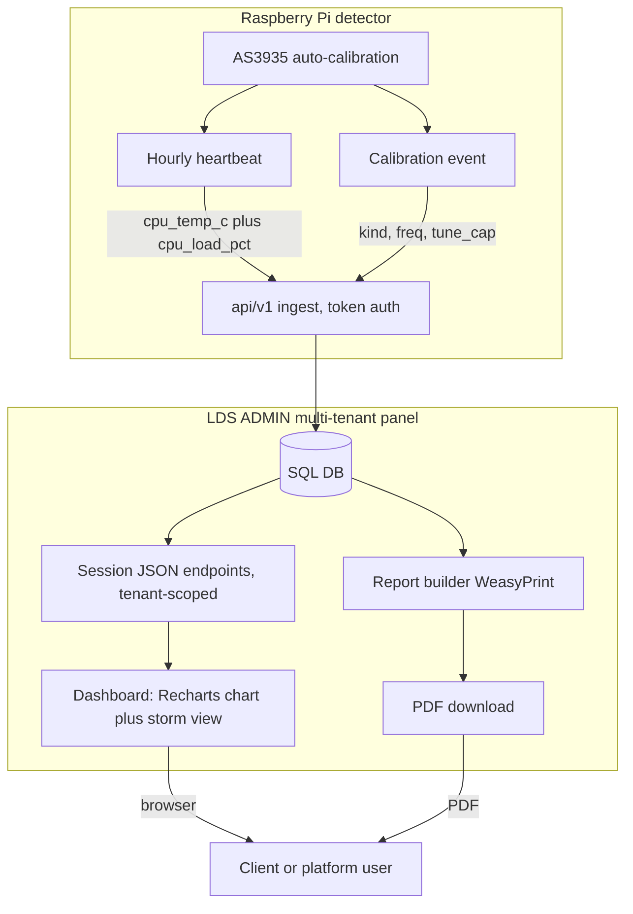

# Design Document

## Overview

This design adds two downloadable PDF reports, a station metadata section,
an interactive Recharts CPU chart, a storm-activity visualisation with an
energy legend, longer telemetry retention, and the detector-side telemetry
needed to feed them, all within the multi-tenant `LDS ADMIN` panel and its
existing tenant-isolation model.

It also closes two data gaps found in the current code:

1. The detector never sends CPU load, so `heartbeat_samples.cpu_load_pct`
   is always null.
2. No calibration activity ever reaches the panel, so a "calibration
   report" has nothing real to show. This design adds a calibration
   telemetry path.

All new reads reuse the existing `tenant_id` dependency and `scope()` /
`scoped_get()` helpers so no query crosses a tenant boundary. All new
browser assets are self-hosted to satisfy the panel's strict
Content-Security-Policy (`script-src 'self'`).

## Design Decisions and Rationale

### D1. PDF engine: WeasyPrint (HTML/CSS to PDF)

WeasyPrint renders a small Jinja HTML template plus embedded SVG into a
vector PDF, which matches the requirement for high-resolution vector
artwork and lets reports reuse the panel/Stratus theme with a lean
template. ReportLab (pure Python) was considered; it needs no system
libraries but requires hand-built layout and makes themed, chart-rich
pages harder.

Cost: WeasyPrint needs system libraries (Pango, Cairo, GDK-Pixbuf, libffi)
added to the Dockerfile, and a metric-compatible font for Arial. Linux
usually lacks Arial, so we bundle Liberation Sans (Arial-metric compatible)
and map it via CSS `font-family: Arial`. Text stays vector and selectable.

### D2. Charts in reports: server-side SVG (reuse existing approach)

The report PDFs embed server-generated SVG charts (extending the existing
pure-Python `charts.py`). SVG keeps artwork vector and avoids a headless
browser or raster export. The live dashboard chart is separate (Recharts,
below): interactive on screen, static vector in the PDF.

### D3. Recharts under strict CSP: vendored UMD, no build toolchain

Recharts is a React library. The repo is Python-only and CSP forbids CDNs
and inline scripts. We self-host the production UMD builds of React,
ReactDOM, and Recharts under `app/static/vendor/`, and an external
`app/static/js/cpu-chart.js` that reads a `data-endpoint` attribute on a
chart container and renders the chart. No inline script is used, no Node
runtime is required, and `script-src 'self'` / `connect-src 'self'` are
both satisfied (the chart fetches JSON from a same-origin endpoint).

### D4. Calibration telemetry path (new)

The detector already performs RC recalibration and a daily antenna check.
It will POST a compact calibration event to a new token-authenticated
`/api/v1/calibration` endpoint whenever a recalibration or antenna check
occurs. The panel stores these in a new `calibration_events` table used by
the technical report. Posts are best-effort with a short timeout so the
detector's interrupt loop never stalls, matching the existing heartbeat
webhook pattern.

### D5. Station metadata placement: per station on `unit_status`

`site_name` exists per tenant, but telemetry and events are per station.
Coordinates and a site label are therefore added as nullable columns on
`unit_status` (`latitude`, `longitude`, `site_label`) via the existing
`add_missing_columns()` migration. Display falls back to site_label, then
tenant `site_name`, then `station_id`.

### D6. Retention: extend prune window, keep it bounded

The heartbeat prune changes from 48 hours to a configurable
`HEARTBEAT_RETENTION_DAYS` (default 70), which covers the two most recent
calendar months plus the current one. Hourly samples over 70 days per
station is a few thousand rows, so growth stays bounded. Calibration
events are rare and kept for 400 days.

### D7. Subdomain routing unchanged

The panel is served at a stratusweather.co.za subdomain; client panels
stay path-based (`/<slug>`). Per-client subdomains are out of scope.

### D8. Reporting reflects data the panel holds

`AlertEvent` only records strikes the detector forwarded (in-range, within
the detector's alert distance). Reports therefore describe in-range
lightning activity received by the panel, and the report text states this
so figures are not misread as total regional strike counts.

## Architecture



Tenant binding is unchanged: `TenantPrefixMiddleware` resolves `/<slug>`,
`current_user` reconciles cookie, user, and URL tenant, and route handlers
depend on `tenant_id` and filter through `scope()`.

## Data Models

### New nullable columns on `unit_status` (via `add_missing_columns`)

| Column      | Type         | Notes                                  |
|-------------|--------------|----------------------------------------|
| latitude    | REAL/FLOAT   | -90..90, null if unset                 |
| longitude   | REAL/FLOAT   | -180..180, null if unset               |
| site_label  | VARCHAR(120) | Per-station label, null falls back     |

`_ADDED_COLUMNS["unit_status"]` gains these three entries so existing
databases are topped up in place.

### New table `calibration_events`

| Column          | Type         | Notes                                        |
|-----------------|--------------|----------------------------------------------|
| id              | INTEGER PK   |                                              |
| tenant_id       | INTEGER idx  | Resolved from `station_id` at ingest         |
| station_id      | VARCHAR(64)  | idx                                          |
| ts              | DATETIME idx | SAST                                         |
| kind            | VARCHAR(16)  | rc_recal or antenna_check                    |
| reason          | VARCHAR(24)  | temp_delta, interval, scheduled (nullable)   |
| cpu_temp_c      | FLOAT        | nullable                                     |
| freq_hz         | INTEGER      | measured antenna freq (antenna_check)        |
| in_tolerance    | BOOLEAN      | antenna within 3.5 percent of 500 kHz        |
| tune_cap_before | INTEGER      | nullable                                     |
| tune_cap_after  | INTEGER      | nullable                                     |

Created by `Base.metadata.create_all`. No backfill required (new, optional data).

### Energy bands (derived, not stored)

21-bit full scale is 2,097,151. Bands are computed from the relative value:

| Band     | Range (inclusive)      | Approx. full scale | Colour (data accent) |
|----------|------------------------|--------------------|----------------------|
| Low      | 0 .. 524,287           | 0 to 25 percent    | light grey-blue      |
| Moderate | 524,288 .. 1,048,575   | 25 to 50 percent   | navy                 |
| High     | 1,048,576 .. 1,572,863 | 50 to 75 percent   | amber                |
| Extreme  | 1,572,864 .. 2,097,151 | 75 to 100 percent  | red                  |

An "elevated fire risk" marker is drawn at 1,000,000 (about 48 percent)
per the AS3935 energy guidance. The legend states plainly that energy is a
relative, dimensionless scale, not Joules or Watts.

### JSON response shapes (browser endpoints)

- CPU series: `{station, site, warn:70, crit:78, points:[{t, temp, load}]}`
- Strikes: `{radius_km, rings:[km...], strikes:[{t, distance_km, energy, band}]}`

## Components and Interfaces

### Detector component (`detector/lightning_detector.py`)

1. Add `get_cpu_load()` reading `/proc/loadavg` (1-minute average) divided
   by CPU count, expressed as a percentage; return None on failure.
2. Include `cpu_load_pct` in the `_heartbeat_webhook` payload alongside
   `cpu_temp_c`. Omit or null on read failure (panel already tolerates it).
3. Emit calibration events best-effort:
   - In `_temperature_compensation`, after a successful `calibrate()`, POST
     `{kind: "rc_recal", reason, cpu_temp_c}`.
   - In `_antenna_frequency_check`, POST `{kind: "antenna_check", freq_hz,
     in_tolerance, tune_cap_before, tune_cap_after, cpu_temp_c}`.
   - Reuse the short-timeout, error-swallowing helper style so the IRQ loop
     never blocks. Gate with an enable flag defaulting on.

Backward compatibility: older detectors that send neither field keep
working; the panel stores nulls and reports show "not reported".

### Detector-facing ingest API (token auth, `/api/v1`)

- `POST /api/v1/calibration` (new): validates a `CalibrationPayload`
  (station_id, kind, optional reason, cpu_temp_c, freq_hz, in_tolerance,
  tune_cap_before, tune_cap_after, timestamp), resolves tenant via
  `unit_tenant_id`, inserts a `calibration_events` row. Best-effort, returns
  `{status: ok}`. Same token check as heartbeat.
- `POST /api/v1/heartbeat` (existing): unchanged server-side; it already
  accepts and stores `cpu_load_pct`. The prune window moves to a setting
  (see retention).

### Session JSON endpoints for the browser (tenant-scoped, web router)

These depend on `current_user` and `tenant_id` and filter with `scope()`:

- `GET {base}/data/cpu?station=<id>&range=24h|7d|30d`: returns the CPU series
  shape above; data limited to the current tenant and station.
- `GET {base}/data/strikes?station=<id>&window=<minutes>`: returns recent
  in-range strikes for the storm view, tenant-scoped.

### Reports interface (session auth, tenant-scoped, web router)

- `GET {base}/reports`: lists available months per station (months where
  telemetry or events exist) and the two report types. Viewer can view and
  download; generation controls are shown only to writers.
- `POST {base}/reports/generate`: `require_writer`; body has station, month
  (YYYY-MM), type (technical or client). Builds the PDF, caches it under
  `data/reports/<tenant_slug>/<station>/<month>-<type>.pdf`, returns a link.
- `GET {base}/reports/download?station=&month=&type=`: streams the cached
  PDF, regenerating if missing. `FileResponse` with
  `Content-Disposition: attachment`. The path is derived from validated
  inputs, never from raw user paths, and is tenant-scoped.

### Report builder (`reports.py`)

```
build_report(db, tenant, station_id, year_month, report_type) -> bytes
  1. resolve station metadata (site_label -> tenant.site_name -> station_id;
     latitude/longitude or "not set")
  2. gather data for the SAST month window [start, next_month_start):
       - heartbeat_samples  -> uptime, CPU temp stats, WARN/CRIT counts, trend
       - calibration_events -> recal count, antenna checks, tune_cap changes
       - alert_events       -> total, closest, distance + energy histograms
  3. render server-side SVG charts (charts.py additions)
  4. render a lean Jinja HTML template (Arial via bundled Liberation Sans)
  5. WeasyPrint -> PDF bytes
```

Charts added to `charts.py` (all vector SVG, Arial, no em dashes):
`cpu_trend_svg(samples, hours)`, `distance_histogram_svg(events)`,
`energy_band_histogram_svg(events)`, `uptime_gauge_svg(pct)`,
`storm_rings_svg(events, radius)`.

Report sections:

- Technical report: header (site, coordinates, station, month); availability;
  CPU temperature statistics with WARN/CRIT counts and trend chart;
  calibration activity (recalibration count, antenna check table with
  frequency and tolerance, tune_cap adjustments); strike statistics
  (total, closest, distance histogram, energy-band histogram); footer.
- Client summary report: themed cover (site, coordinates, month); system
  specifications summary; availability; lightning activity overview with a
  distance range-ring illustration and energy legend; vector charts; closing
  note explaining the relative energy scale and the in-range data note.

Empty month renders a valid PDF stating no data was recorded. Availability
is expected hourly heartbeats over the month versus received distinct hourly
samples, clamped to 0..100 percent.

### Frontend components

CPU chart (Recharts):
- Container `<div id="cpu-chart" data-endpoint="{base}/data/cpu?station=..."
  data-range="24h">` plus timeframe buttons (24h, 7d, 30d) that set
  `data-range` and re-fetch.
- `app/static/js/cpu-chart.js` (external) fetches JSON, builds a Recharts
  LineChart via the vendored UMD globals, draws temperature and load series,
  axis labels, legend, and WARN/CRIT reference lines, and shows an
  empty/collecting state when there are no points. Vendor or fetch failure
  leaves the rest of the page working with a static fallback note.
- Assets: `app/static/vendor/react.production.min.js`,
  `react-dom.production.min.js`, `recharts.min.js` loaded with same-origin
  `<script src>`.

Storm-activity visualisation:
- `app/static/js/storm-view.js` draws concentric distance range-rings, plots
  recent strikes by distance only (with a visible "bearing not measured"
  note), animates a pulse per new strike, colour-codes by energy band, and
  shows an on-screen legend. A subtle CSS cloud/storm backdrop stays behind
  the data. `prefers-reduced-motion` and load failure fall back to a static
  distance view.

Station metadata UI:
- A metadata section (linked from settings or the dashboard) lists the
  tenant's stations and lets writers edit `site_label`, `latitude`,
  `longitude`. Server-side validation enforces coordinate ranges; the form
  carries the existing CSRF token; saves are tenant-scoped.

## Security and Tenant Isolation

- Browser JSON and report endpoints depend on `tenant_id`; every query uses
  `scope(...)` or `scoped_get(...)`. A user cannot read or download another
  tenant's data or report; unknown ids read as "not found".
- Report file paths are built from validated station/month/type and the
  tenant slug, never from raw user input, preventing traversal.
- Detector ingest stays token-authenticated; new units file under the
  platform tenant until assigned, matching current behaviour.
- All new scripts, styles, fonts, and vendored libraries are same-origin,
  so the existing CSP is unchanged.
- Report generation runs in the web request path, separate from the alert
  worker, so it cannot delay alert dispatch.

## Error Handling

- Calibration ingest and heartbeat store failures roll back and log without
  failing the detector post.
- Report generation is wrapped so a builder error returns a friendly message
  and logs the cause; the panel does not crash.
- Chart and storm-view scripts degrade gracefully on fetch or vendor errors.
- Coordinate validation returns a 400 with a clear message on bad input.

## Correctness Properties

### Property 1: Tenant isolation

**Validates: Requirements 3.3, 5.8, 8.1, 10.5**

For any set of rows across two tenants, the CPU, strikes, and report queries
for tenant T return only rows whose `tenant_id == T`.

### Property 2: Energy band totality and monotonicity

**Validates: Requirements 1.5, 2.5, 8.3, 8.4**

`energy_band(e)` is defined for every integer e in [0, 2,097,151]; if
e1 <= e2 then band_index(e1) <= band_index(e2); band boundaries are exactly
as tabulated.

### Property 3: Coordinate validation

**Validates: Requirements 4.2**

`valid_coords(lat, lon)` is true if and only if -90 <= lat <= 90 and
-180 <= lon <= 180.

### Property 4: Uptime bounds

**Validates: Requirements 1.2, 2.2**

`uptime_pct(received, expected)` lies in [0, 100], equals 100 when
received >= expected > 0, and is non-decreasing in received.

### Property 5: SAST month window

**Validates: Requirements 1.1, 2.1**

A timestamp is included in month M if and only if it lies in
[start_of_M, start_of_next_M) evaluated in SAST.

### Property 6: Retention safety

**Validates: Requirements 7.1, 7.2**

After prune, no sample with age within the retention window is deleted, and
every sample older than the window is removed.

### Property 7: Report totality

**Validates: Requirements 1.6, 2.1, 10.3**

For any station and month, including months with no data, the builder
returns valid PDF bytes (starting with the PDF header) and does not raise.

### Property 8: Heartbeat backward compatibility

**Validates: Requirements 6.2, 6.4**

A heartbeat without `cpu_load_pct` is accepted and stored with a null load;
one with a value stores that value.

## Testing Strategy

- Property-based tests (pytest plus hypothesis) for the pure functions behind
  Properties 2, 3, 4, 5, 6 (energy banding, coordinate validation, uptime
  maths, month-window selection, retention selection).
- Unit tests for `energy_band`, the SVG chart builders (assert well-formed
  SVG and Arial font-family, no em dash characters), and report section
  assembly with empty and populated data (Property 7).
- Integration tests with FastAPI `TestClient`:
  - Tenant isolation on `/data/cpu`, `/data/strikes`, and report endpoints
    across two seeded tenants (Property 1).
  - Auth: unauthenticated requests redirect to login; viewer cannot trigger
    generation; writer can; platform admin can act within a tenant.
  - Heartbeat with and without `cpu_load_pct` (Property 8); calibration
    ingest inserts a row under the correct tenant.
  - Report download returns a PDF (magic bytes) with an attachment header.
- A CSP regression check asserting report and chart pages reference only
  same-origin assets.
- Detector unit tests for `get_cpu_load()` parsing and payload construction,
  with network posts mocked.

## Requirements Traceability

| Requirement | Addressed by |
|-------------|--------------|
| R1 Technical report | Report builder, calibration_events, charts.py, /reports |
| R2 Client summary report | Report builder client template, energy legend, SVG charts |
| R3 Access, download, isolation | Session endpoints, tenant scope, role checks, file paths |
| R4 Station metadata | unit_status columns, metadata UI, coordinate validation |
| R5 Recharts CPU chart | Vendored UMD, cpu-chart.js, /data/cpu, timeframe controls |
| R6 CPU load telemetry | Detector get_cpu_load plus heartbeat field (panel stores it) |
| R7 Retention | HEARTBEAT_RETENTION_DAYS prune, bounded growth |
| R8 Storm visualisation | storm-view.js, /data/strikes, energy bands, reduced-motion |
| R9 PPTX reconciliation | Doc pass vs code: thresholds, cadence, SMS-only, energy scale |
| R10 Reliability/non-regression | Web-path generation, self-hosted assets, scope() everywhere |

